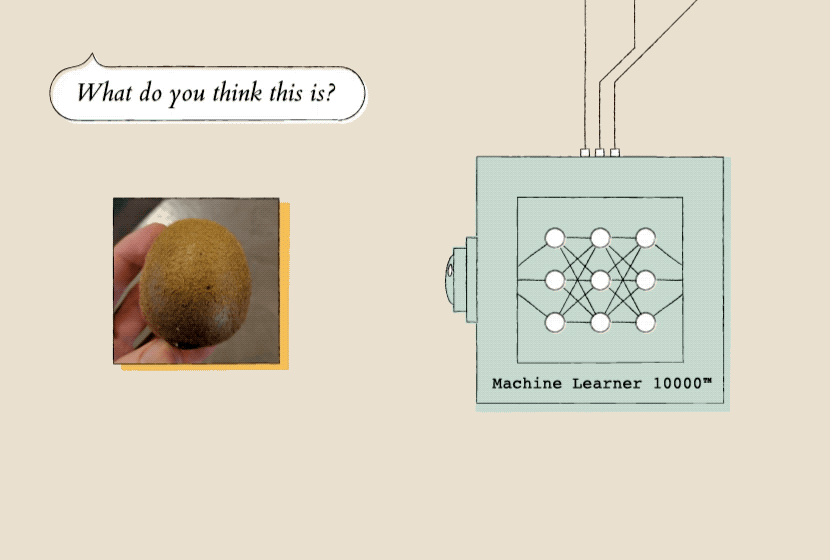

# Handsfree Teachable Machine Learning  👨🏻‍🏫


 \
GIF Credits: Google

The target of this project is to build a voice user interface that allows handsfree training of a machine learning model that involves inputs from webcam. I targeted adding the interface to Teachable Machine by Google's Creative Lab. It is based on Rebecca Fiebrink's wekinator as described by a Google's blog (People + AI Research Group at Google). 

However, instead of modifying Google's AI experiment, I decided to use ML5JS that is an abstraction on top of TensorFlow JS and p5JS (which in itself is based on processing framework). I decided to specifically modify ML5JS's 'KNN Classifier with Feature Extractor' example as it resembles exactly with the Google's AI experiment referenced above but abstracts the details. 


This is undertaken as a part of course assignment for CSCI 5880 under the guidance of [Ben Shapiro](https://www.colorado.edu/atlas/ben-shapiro)

[video](https://youtu.be/6PRZJ4GgH68)

## Getting Started

To utilize this repository, clone the repository in your machine and install nodejs package manager (npm). 

### Prerequisites

* [NodeJS Package Manager](https://www.npmjs.com/get-npm): This is required for running a web server to run JS files.

### Installing

Open a terminal and cd into this repository folder and execute the following commands:
```
npm install -g reload
reload -b
```
This should immediately open up your default browser on a ```localhost:8080``` address and you can explore the application.

For the purposes of merely running this website, we could also use http-server package by NodeJS. I used reload because it automatically relaunches the server whenever I make a change in one of my files, and hence the dev cycle becomes faster.

### How to run already existing model
* Say `Hey Jarvis` and then `load model`
* It will load the dataset from myKNNDataset.json file (if it exists)

### How to train your model
* Say `Hey Jarvis` and then `record rock` or `record scissor` or `record paper` based on what class you would like to record an example for. Currently it only supports 3 classes
* This will capture 5 examples of whatever is in the front of your webcam
* You can repeat this process till how ever many examples you like

## Architecture

I map every button to a voice command which is always prefixed by `Hey Jarvis` wake word. \
 \
GIF Credits - Google


## Built With

* [web speech api](https://pypi.org/project/gym-chrome-dino/) 
* [nodejs package - reload](http://www.wekinator.org/downloads/)
* [ml5js](https://ml5js.org/)


## Acknowledgments

* ML5JS developers
* Prof. Ben Shapiro 

